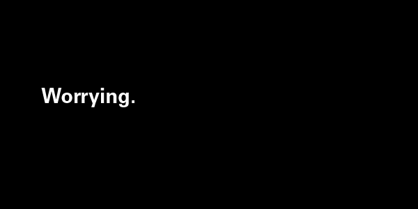

# How to Use Color and Space with a Typeface

I want to talk to you about [Josef Albers][1].

Albers was a teacher of art and the study colour. He was arguably one of the
most influential art teachers in the 20th Century. He developed influential
programs at the Bauhaus, and taught the Yale graphic arts program.

The important thing about Albers was that he was very controversial for most of
his career. His experimental perspective on art and colour polarized the
critical art community. His 1963 book “Interaction of Color,” an exploration of
his colour theories and his lesson style was smeared by many critics upon
release.  The antagonism he seemed to flare without intention was part of a
larger discomfort with his abnormal ideas, and modernism as a whole.

Of course, now Albers highly regarded, as is the modernist era of art, and
“Interaction of Color” is seen by some as revolutionary. I recently finished
“Interaction of Color” myself, and it’s hard to say that I learned any concrete
ideas that I can use. Rather, what I felt I got from the book was inspiration
and excitement, a challenge to seriously think about color and space in new and
more interesting ways.

## Type responds to colour

It’s important to remember when thinking about colour and type, that letters are
nothing more than shapes. Just like triangles, circles, or octagons, letters
also have their own spatial reasoning. Just as circles feel soft and casual,
diamonds sharp and squares overly rational (there’s a reason why the boring are
referred to as “squares”), letters, through their very shape, communicate
feeling and ideas. What makes letters different is they carry an extra semantic
layer that makes them used in alphabet, through which we construct into words
and sentences. But that base layer is very significant on its own.

If shapes have relations to colours in visual art, then letters should too,
right? Therefore, it would make sense that certain typefaces, when placed and
framed in a specific way, look better when used with certain colours. For
example, I discussed in an older column how Univers feels subtle and reserved.
If so, it’s not a surprise that the best use of Univers I’ve seen was on the ’64
issue of the [Typographische Monatsblätter][2], where a black univers is put
onto a transparent yellowish ivory, a less striking counterpart of white or
gray. (A very small use of yellow as well, I tried replicating it in one of my
prints and only used 5% yellow in CYMK). The color certainly isn’t flamboyant
and the contrast between the figure (the font) and the ground isn’t very high.
It’s a more subtle colour! And that matches with Univers’ style.

Another example is [Helvetica][3], a typeface whose weight and density make it
very attractive and attention grabbing. Is it no wonder then, that the best uses
of Helvetica I see are when it alternatives between black/white figure-grounds?
The intense contrast works incredibly well with Helvetica’s shape. It’s a
typeface that commands space and attention in a way that Univers does not, and
an intense figure-ground contrast corresponds to that.

Albers would argue in “Interaction of Color,” that the split between warm
colours and cool colours wasn’t as stable as we’d like to think. He explains
how, within hues, the warm/cool dichotomy can be broken. When mixed with the
right amount of white or black, shades of red can be cool colours just as much
as shades of blue can be warm colors.

Soft, friendly humanist or geometric types like [Global][4], [Pluto Sans][5] or 
[Futura Bold][6] always seem to respond to warm colours much better than other 
types. I say Futura Bold specifically; Futura’s bolder styles are way less 
intense, as they don’t have the sharp apexes and overshoots of its lighter 
counterparts that I went over in my Futura column (I appreciate Stephen Coles 
of Typographica pointing that out to me). Rounded ends, low stroke contrast and 
soft corners creates a warmth that colours like sky blue, light purple, and 
even a bright red would work well with.

*(For serif typefaces, we’d have to split them up between sub-categories, so 
read my last column on choosing types if you’re unsure on how it works.)*

Another example is the humanist, old style, and transitional serifs. These
categories, generally, tend to be very flexible with many contrasts, and
different combinations of colours *except* warmer mixtures. I rarely see serifs
used with bright warm colours like pink or red. These kinds of serifs are rarely
intense or flamboyant. Many of them are transparent, in the sense that they’re
designed to allow easy understanding of the words and sentences – the shapes
themselves become irrelevant when they’re read. Transitionals are especially
tame, which is why they work so well in books and body text. They’re clear and
easy on the eyes.

Modern Serifs are a whole different story. Their high stroke contrast and thin
serifs make them sharp and intense, therefore, they’ve shown to be very
effective in bright colours and intense contrasts.

## Type responds to space

In graphic design you’re usually taught about different kinds of grids and how
they relate to hierarchy. This is information I would say is important, so I
encourage you to read Ellen Lupton’s fantastic [Thinking withType][7], which 
goes over these concepts in detail.

Earlier I mentioned that Helvetica was a typeface that commanded space. I
believe that every typeface holds two kinds of spaces: the space that refers to
the actual size of the glyphs, and the abstract space, which refers how much
room the typeface feels like it’s taking up. How far across a page can the
presence of a word or sentence spread to?

Let me show you an example of what I’m getting at. I’m going to try and create
abstract space that takes up an entire picture using one word in Univers:

If I did this correctly (let’s assume I did for a second), then the picture
should feel whole and complete. In other words, you wouldn’t feel like there
needs to be anything added to it. What we see here is while the real space
Univers’ is taking up is very small, the abstract space it creates takes up the
entire page. The ideas that revolve around “worrying” that are created purely
from the word itself, already fill the picture so that there’s doesn’t need to
be anything else.

The point of abstract space and this demonstration is to show that it’s not
about the superficial nature of objects; it’s about what they communicate. I can
put a comma on a white background and it would look fantastic if those two
elements communicated something strong. Everything on a poster or print or
website is composed of ideas. Every shape and letter is an idea. I encourage you
to think very heavily on how shape and colour are related, what you can create
with the right colors, the right shapes and objects, from photos to
illustrations, and the kinds of amazing ideas you come up with.

[1]: http://en.wikipedia.org/wiki/Josef_Albers
[2]: http://fontsinuse.com/uses/2143/typographische-monatsblaetter-1964-issue-8-9
[3]: http://designmodo.com/helvetica-font/
[4]: http://www.myfonts.com/fonts/dstype/global/
[5]: http://www.myfonts.com/fonts/hvdfonts/pluto-sans/
[6]: http://www.myfonts.com/fonts/tilde/futura/bold/
[7]: http://www.thinkingwithtype.com/contents/grid/
