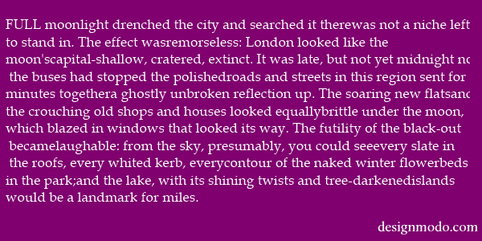
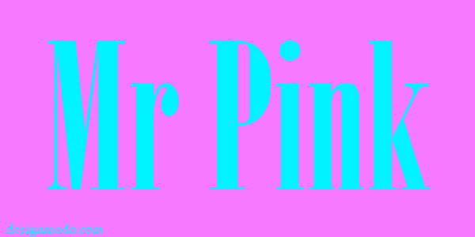
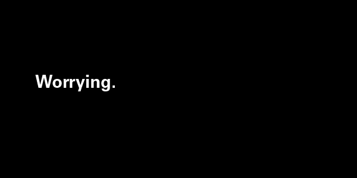

# Как использовать цвет и пространство в совокупности с гарнитурой

Я хочу рассказать вам о [Джозефе Альберсе (Josef Albers)][1].

Альберс преподавал искусство и учение о цвете. Он был, возможно, одним из 
самых влиятельных преподавателей художественных дисциплин в XX веке. Он 
разработал и применял учебные программы в Баухаузе и Йеле.

Важно упомянуть, что на протяжении большей части своей карьеры Альберс имел 
склонность к полемике. Его экспериментальная точка зрения на искуство и цвет 
разделило сообщество критического искусства. Его книга "Взаимодействие цветов" 
1963 года, исследование теории цвета и его стиль преподавания были 
раскритикованы многими с момента выхода их в свет. Противоречие, которое он 
неумышленно олицетворял, было отчасти вызвано его нестандартными идеями и 
модернизмом в целом.

Сегодня Альберс, конечно, уважаем, как и вся эра модернизма в искусстве, а 
«Взаимодействие цветов» рассматривается некоторыми как революционный в сфере 
искусства труд. Я сам совсем недавно закончил читать «Взаимодействие цветов». 
Сложно сказать, что я почерпнул оттуда какие-то конкретные идеи, которые мог 
бы использовать. Тем не менее, я чувствую, что эта книга дала мне вдохновение 
и стимул взглянуть на цвет и пространство с альтернативных точек зрения.

## Цвет влияет на представление гарнитуры

Говоря о цвете и гарнитуре, важно помнить, что буквы — не более чем фигуры. 
Как и треугольники, круги и восьмиугольники, буквы также имеют свое значение в 
пространстве. Круги кажутся мягкими и универсальными, ромбы острыми, а 
квадраты рациональными (вот и причина, почему в английском языке в разговорной 
речи скучные, старомодные люди называются "square" *(англ. square — квадрат, 
прим. переводчика)*) — так и буквы с помощью своей формы передают смысл и идею. 
Что делает буквы особенными по сравнению с остальными фигурами, так это 
дополнительный семантический слой, позволяющий собирать их в алфавит, из 
которого можно составить слова и предложения. Но именно этот основной слой 
является очень значимым сам по себе.

Если в визуальном искусстве можно говорить о соотношении фигуры и цвета, то 
такое соотношение должно существовать и для букв, верно? Получается, имеет 
смысл утверждение, что определенные гарнитуры в отдельных случаях выглядят 
лучше при использовании определенных цветов. Например, в одной из предыдущих 
колонок я рассуждал, насколько гарнитура Univers выглядит тонкой и сдержанной. 
Если это так, то не удивительно, что лучшее использование Univers, которое я 
когда-либо видел, это выпуск журнала [«Typographische Monatsblätter»][2] 
1964-го года, где черные буквы, набранные Univers, помещены на желтоватый, 
цвета слоновой кости, фон, менее яркий, чем белый или серый. (В этом цвете 
совсем немного желтого, я пытался воспроизвести его в одном из своих макетов 
и использовал всего 5% желтого в CMYK). Цвет совсем не яркий, и контраст между 
фигурой (текстом) и фоном невысок. Это более тонкий цвет! И он подходит к 
стилю гарнитуры Univers.

Другой пример — [Helvetica][3], гарнитура, чей вес и плотность делают ее очень 
привлекательной и притягивающей внимание. Никакого чуда нет в том, что лучшее 
использование Helvetica, которое я вижу, это когда она противопоставляется 
черному или белому фону. Интенсивный контраст работает невероятно круто 
с формой Helvetica. Это гарнитура, которая управляет пространством и вниманием 
так, как этого не делает Univers, и интенсивный контраст между фигурой и фоном 
в этом ей помогают.

Во «Взаимодействии цветов» Альберс утверждает, что разделение цветов на теплые 
и холодные не настолько фундаментально, как мы привыкли думать. Он объясняет, 
как дихотомия "теплый-холодный" может быть разрушена в оттенках. При смешении 
с определенным количеством белого или черного оттенки красного могут быть 
холодными цветами, в то время как оттенки синего могут быть теплыми.

Мягкие, приветливые гуманистические или геометрические гарнитуры, такие как 
[Global][4], [Pluto Sans][5] или [Futura Bold][6] всегда лучше, чем другие 
гарнитуры, выглядят с теплыми цветами. Я специально упомянул именно Futura 
Bold; полужирные начертания Futura менее напряженные, потому что у них нет 
острых вершин и верхних свисаний по сравнению с более легкими аналогами, 
которые я указывал в своей колонке о Futura (Благодарю Стивена Колса 
(Stephen Coles) из Typographica за то, что он указал мне на это). Скругленные 
окончания, низкий констраст и мягкие углы создают теплоту, с которой отлично 
сочетаются цвета, такие как небесно голубой, ярко-пурпурный и даже 
ярко-красный.

*(Шрифты с засечками нам следует разделять на подкатегории, поэтому обратите 
внимание на мою последнюю колонку о выборе цветов, если вы не уверены в том, 
как все это работает.)*

Другой пример — это гуманисты, гарнитуры старого стиля и переходная антиква. 
Эти категории, в основном, могут быть очень гибкими для использования в 
контрасте и в различных комбинациях цветов *кроме* теплых смешений. Я редко 
вижу использование шрифтов с засечками с яркими теплыми цветами, такими как 
розовый и красный. Эти типы шрифтов редко являются напряженными и бросающимися 
в глаза. Многие из них достаточно прозрачны, в том смысле, что они разработаны, 
чтобы обеспечить легкое восприятие слов и предложений — глифы сами по себе 
теряют значение при чтении. Переходные гарнитуры особенно привычны глазу, 
поэтому они хорошо подходят для книг и в качестве основной гарнитуры для 
текста. Они ясные и легко воспринимаются глазом.

Современные шрифты с засечками — это совершенно другая история. Высокий 
контраст штрихов и тонкие засечки делают их острыми и напряженными, поэтому 
они будут выглядеть очень эффектно в ярких цветах и в сильном контрасте с фоном.

## Пространство влияет на представление гарнитуры

В графическом дизайне обычно учат различным видам сеткок и тому, как они влияют 
на иерархию. Я считаю, что это очень важно, и поэтому я призываю вас прочитать 
фантастическую книгу Эллен Лаптон [«Мышление в шрифте»][7], в которой об этом 
подробно рассказывается.

Ранее я упоминал, что Helvetica — гарнитура, которая управляет пространством. 
Я верю, что каждая гарнитура характеризуется двумя пространствами — 
пространством, соответствующим размерам глифов, и абстрактным пространством, 
которое описывает, насколько влиятельна гарнитуры. Как далеко на странице 
распространяется влияние слова?

Давайте, я покажу вам, о чем я говорю, на примере. Я собираюсь создать 
абстрактное пространство, которое занимает все изображение, с помощью одного 
слова, набранного гарнитурой Univers:

*(Worrying — англ. беспокойство, прим. переводчика)*

Если я все сделал правильно (давайте предположим на секунду), то изображение 
должно выглядеть законченным и цельным. Другими словами, у вас не должно 
возникать ощущения, что к изображению необходимо что-то добавить. Мы видим, что 
слово, набранное Univers занимает достаточно мало реального пространства, но 
абстрактное пространство, которое оно создает, занимает всю страницу. Идея, 
возникающая вокруг самого слова «беспокойство», заполняет изображение целиком, 
поэтому на нем больше ничего и не нужно.

Смысл абстрактного пространства и этой демонстрации в том, чтобы показать, что 
речь идет не о внешнем виде объектов, а о том, что они сообщают. Я могу 
поместить запятую на белый фон, и это будет выглядеть фантастически, если эти 
2 элемента будут нести какой-то сильный смысл. На плакате или сайте все состоит 
из идей. Каждая фигура и буква — это идея. Я призываю вас подумать очень 
серьезно о том, как связаны форма и цвет, что вы можете создать, используя 
правильные цвета, правильные фигуры и объекты, от фотографий до иллюстраций, 
и к каким восхитительным идеям вы придете.

[1]: http://en.wikipedia.org/wiki/Josef_Albers
[2]: http://fontsinuse.com/uses/2143/typographische-monatsblaetter-1964-issue-8-9
[3]: http://designmodo.com/helvetica-font/
[4]: http://www.myfonts.com/fonts/dstype/global/
[5]: http://www.myfonts.com/fonts/hvdfonts/pluto-sans/
[6]: http://www.myfonts.com/fonts/tilde/futura/bold/
[7]: http://www.thinkingwithtype.com/contents/grid/
